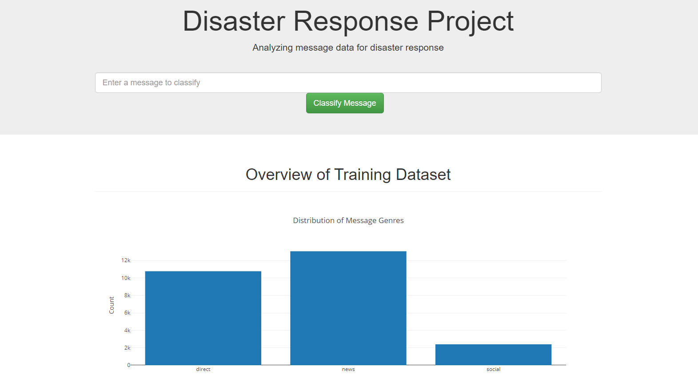

# Disaster Response Pipeline Project

This is a project demonstrating ETL and ML pipelines on disaster response data provided by Figure Eight.

### Project repository:
https://github.com/jakubkocvara/Disaster-Response-Pipeline

### Required libraries:
* pandas
* sklearn
* nltk (including punkt, wordnet, averaged_perceptron_tagger, maxent_treebank_pos_tagger, stopwords)
* flask
* sqlalchemy
* plotly

### ETL
Creation of the input dataset consists of transforming the `disaster_categories.csv` into individual columns which indicate association with a label and appending them on `disaster_messages.csv` 

### Text preprocessing
We are removing non-alphabetical strings, english stopwords and lemmatizing words in the text.

Lemmatization is performed using part-of-speech tagging with the help of Wordnet corpus. Afterwards we can use `WordnetLemmatizer` to accurately transform words based on their part-of-speech category.

This can be quite slow, that is why this step can be optionally performed on multiple cores simultaneously to speed up the process.

### Machine learning pipeline
* Vectorization - texts are transformed into matrices using tf-idf vectorizer
* Classification - Random Forest classifiers are trained for predicting each of 36 possible labels separately. Scikit-learn's `MultiOutputClassifier` was used for this purpose.

3-fold cross-validation was used for determining the best performing model. For tf-idf we tried vectorization on unigrams and bigrams. For classification: Random forests we looked if 50 estimators or 100 estimators work better in our case.

### Instructions:
1. Run the following commands in the project's root directory to set up your database and model.

    - To run ETL pipeline that cleans data and stores in database
        `python data/process_data.py data/disaster_messages.csv data/disaster_categories.csv data/DisasterResponse.db`
    - To run ML pipeline that trains classifier and saves
        `python models/train_classifier.py data/DisasterResponse.db models/classifier.pkl`

2. Run the following command in the app's directory to run your web app.
    `python run.py`

3. Go to http://0.0.0.0:3001/